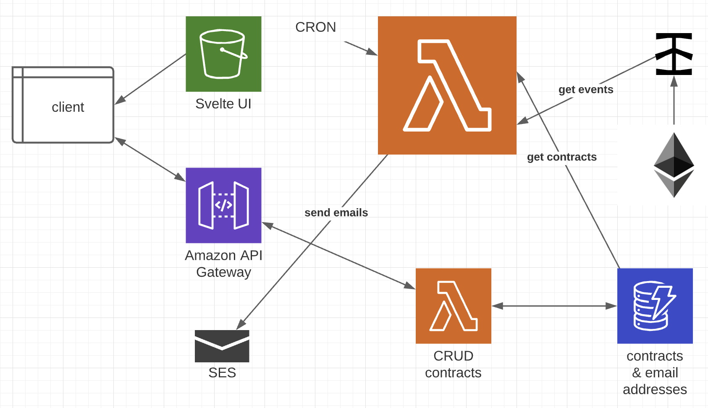

# Contract Events Monitoring

Enter Ethereum smart contract addresses and ABIs, and enter email addresses to receive emitted Events.

### UI 
deployed at: http://oz-contract-event-monitoring-svelte-ui.s3-website.us-east-2.amazonaws.com

---

### Serverless

This project uses the [serverless](https://www.serverless.com/) framework.

Plugins used:
- [serverless-plugin-typescript](https://github.com/prisma-labs/serverless-plugin-typescript) 
- [serverless-webpack](https://github.com/serverless-heaven/serverless-webpack)
- [serverless-s3-sync](https://github.com/k1LoW/serverless-s3-sync)

---

### Todo

- [x] set up SES
- [x] test send email
  - [x] debug error with fs.readFileSync
- [ ] run locally
- [x] deploy using serverless
- [ ] build out UI
  - [ ] create all components
  - [ ] connect to APIs
- [ ] test lambdas
- [ ] get contracts for testing
- [ ] test getting events from contracts
