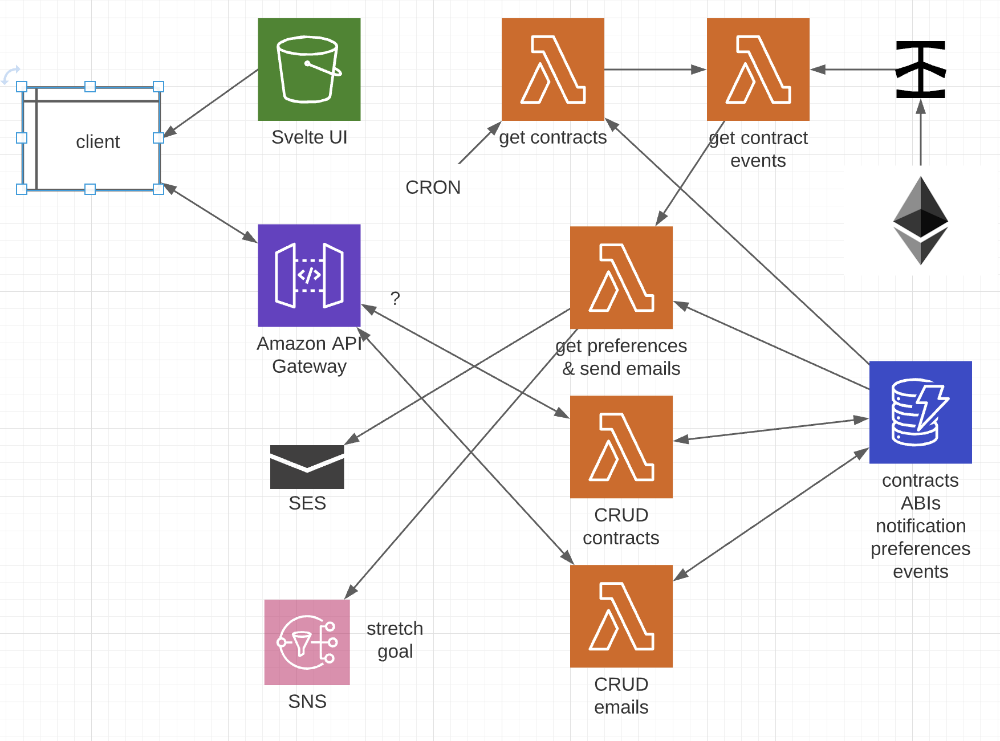

# Contract Events Monitoring

Enter Ethereum smart contract addresses and ABIs, and enter email addresses to receive emitted Events.

lambdas needed:
* CRON -> contracts -> events -> emails
* CRUD contracts
* test email

### Todo

- [ ] set up SES
- [ ] test send email
- [ ] build out UI
- [ ] test lambdas
- [ ] get contracts for testing
